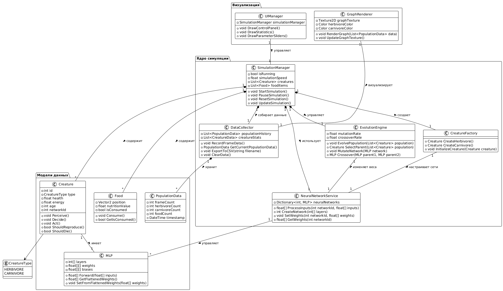

# Концепция дипломного проекта: "Разработка игрового приложения в Unity с использованием нейронных сетей"

## 0. Проблема

Описания макроскопических теорий, которые порой упрощают и не рассматривают детально микропроцессы, которые влияют (порой нетривиально) на рассматриваемую систему, порождают разрыв в понимании микро- и макро- процессов. Как следствие, возникает страдание у изучающих, которые не видят важной взаимосвязи между ними, и понижение интереса познания, так как в общности порой сложно увидеть практическую реализацию.

Исследователь или студент, касающийся в том или ином виде динамики модели популяций, может испытывать **недоумение** в ходе анализа **сухих** диффернциальных уравнений, e.g. в моделе "Хищник - Жертва" Лотки-Вольтерры, и **фрустрацию** из-за невозможности влияния на наглядные демонстрации подобных систем. Так происходит ввиду отсутствия устойчивых к пользовательскому вводу интерактивных симуляций.

## 1. Сценарии

1. Проблемы текущего состояния:

 * Отсутствие наглядного и интерактивного влияния микропроцессов в системе на макропроцессы  
 * Отсутствие наглядного инструмента для связи рассматриваемой системы и математической модели  

2. Решающие особенности инструмента:

 * **Интерактивность** - пользователь может влиять на микропроцессы (участвовать в качестве агента) и макропроцессы (настраивать экосистему)  
 * **Приспосабливаемость** - система должна быть устойчива к недетерминированному пользовательскому вводу  
 * **Визуализация данных** - система строит на основании системы математическую модель и отображает результаты  

3. Ограничения:

 * Пользователь не может добавлять в систему концептуально новые сущности  
 * Поведение существ ограничено их рецепторами  

4. Полная формулировка задачи:  
Разработать интерактивное приложение-симулятор в среде Unity, которое наглядно демонстрирует динамику экосистемы "хищник-жертва" через поведение автономных поведенчески приспосабливающихся ИИ агентов, управляемых многослойными перцептронами (MLP), и предоставляет инструменты для анализа получаемых данных, включая построение графиков популяций и аппроксимацию их дифференциальными уравнениями.

5. Клиентский путь:

| Стадия пути | Активности | Чувства | Опыт | Ожидания |
|-------------|------------|---------|------|----------|
| **Осознание проблемы** | - Изучение теоретических моделей - Попытка понять математические формулы | `разочарование`, `сомнение`, `тревога` | Сложные диффуры и графики кажутся абстрактными и оторванными от реальности. Нет интуитивного понимания | Хочется наглядного примера, который покажет "как это работает в жизни" |
| **Поиск решения** | - Поиск материалов в интернете - Просмотр видео с симуляциями - Спрашивание у коллег | `любопытство`, `интригованность`, `неловкость` | Понимание, что одних формул недостаточно. Желание найти инструмент для экспериментов | Найти простой и понятный способ визуализации моделей популяций |
| **Первое знакомство** | - Запуск приложения - Просмотр стартового сценария - Изучение интерфейса | `удивление`, `любопытство`, `неловкость` | Видит живую экосистему в действии, но не до конца понимает все элементы управления | Разобраться, как работать с симуляцией, понять базовые принципы |
| **Экспериментирование** | - Изменение параметров (скорость еды, число агентов) - Наблюдение за изменениями - Постановка "что если" экспериментов | `амбициозность`, `вдохновение`, `целеустремлённость` | Понимание причинно-следственных связей: как параметры влияют на динамику системы | Увидеть закономерности, проверить свои гипотезы о работе экосистемы |
| **Анализ результатов** | - Изучение графиков популяций - Анализ выведенных уравнений - Сравнение с теоретическими моделями | `удовлетворение`, `гордость`, `успех` | Математика оживает: видит соответствие между теорией и практикой, понимает глубину моделей | Убедиться, что симуляция соответствует научным принципам, получить данные для анализа |
| **Глубокое понимание** | - Формулирование выводов - Применение знаний в учёбе/работе - Делится открытиями с другими | `счастье`, `вдохновение`, `уверенность` | Сложные концепции становятся ясными и понятными. Появляется уверенность в знаниях | Закрепить понимание темы, использовать полученные знания на практике |

## 3. Архитектура

### 3.1 Функциональная архитектура

**Ядро симуляции:**
* Менеджер симуляции - управление временем, состоянием и сценариями
* Система существ - базовые параметры агентов (здоровье, энергия, возраст)
* Система нейронных сетей - MLP для принятия решений агентами
* Генетический алгоритм - эволюция весов нейросетей между поколениями

**Логика агентов:**
* Система восприятия - сбор данных об окружении (еда, хищники, сородичи)
* Система принятия решений - преобразование входных данных в действия через MLP
* Система действий - движение, питание, размножение, атака
* Система размножения - создание новых агентов с наследованием характеристик

**Окружение и ресурсы:**
* Генератор еды - создание и управление ресурсами для травоядных
* Система коллизий - обработка столкновений между объектами
* Физика движения - перемещение агентов в пространстве

**Интерфейс и данные:**
* Система сбора статистики - мониторинг популяций в реальном времени
* Визуализатор графиков - отображение динамики популяций
* Пользовательский интерфейс - управление симуляцией и параметрами
* Анализатор данных - аппроксимация данных дифференциальными уравнениями

### 3.2. Программная архитектура

**Архитектурный паттерн:** Модифицированный Entity-Component-System в рамках Unity

**Слои приложения:**
* **Слой движка** (Unity Engine) - рендеринг, физика, анимация
* **Логика** (C# Scripts) - игровая механика, ИИ, симуляция
* **UI-слой** (Unity UI) - интерфейс пользователя, визуализация данных
* **Сервисный слой** - утилиты, математические функции, работа с данными

**Ключевые модули:**
* `SimulationManager` - управляет всей симуляцией
* `CreatureFactory` - фабрика по созданию агентов
* `NeuralNetworkService` - сервис работы с MLP
* `EvolutionEngine` - движок генетического алгоритма
* `DataCollector` - сбор и агрегация статистики

**UML диаграмма:**

### 3.3. Аппаратная архитектура
*   **Платформа:** PC (Windows).
*   **Требования:** Стандартные для Unity-приложения. Интегрированные решения не требуются. Критичные компоненты: CPU (для расчетов MLP) и GPU (для визуализации 2D сцены).

### 3.4. Матрица С4

| Уровень | Что (Что делает) | Как (Каким образом) | Где (Где выполняется) | Кто (Кто использует/отвечает) | Когда (Когда выполняется) | Почему (Зачем нужно) |
|---------|------------------|---------------------|----------------------|-------------------------------|--------------------------|---------------------|
| **Контекст** | Симулятор экосистемы "хищник-жертва" с нейросетевыми агентами | Визуализирует динамику популяций через поведение MLP-агентов | Локально на ПК пользователя | Студент/исследователь (пользователь), Разработчик (создатель) | Во время изучения моделей популяций | Для интуитивного понимания сложных математических моделей |
| **Контейнер** | Unity-приложение (исполняемый файл) + Unity Engine | C# скрипты, встроенная физика, UI система | Windows/macOS, Unity Runtime | Пользователь запускает, Unity выполняет | При запуске .exe файла | Для обеспечения кроссплатформенной визуализации и симуляции |
| **Компонент** | SimulationManager - управление симуляцией NeuralNetworkService - работа с MLP EvolutionEngine - генетический алгоритм DataCollector - сбор статистики CreatureFactory - создание агентов | Через MonoBehaviour.Update(), корутины, события Unity | Внутри Unity Player | SimulationManager координирует другие компоненты | Каждый кадр симуляции | Для разделения ответственности и модульности системы |
| **Код** | **SimulationManager** - StartSimulation(), PauseSimulation() **CreatureFactory** - CreateHerbivore(), CreateCarnivore() **NeuralNetworkService** - ProcessInputs(), CreateNetwork() **EvolutionEngine** - EvolvePopulation(), MutateNetwork() **DataCollector** - RecordFrameData(), ExportToCSV() **Creature** - Perceive(), Decide(), Act() | Через вызовы методов, наследование MonoBehaviour, работу с коллекциями | В соответствующих .cs файлах проекта Unity | Разработчик реализует, система выполняет | В runtime согласно игровому циклу Unity | Для реализации конкретной функциональности каждого модуля |

### 3.5 Матрица Захмана

| Перспектива \ Аспект | Что (Данные) | Как (Функции) | Где (Расположение) | Кто (Люди) | Когда (Время) | Почему (Мотивация) |
|---------------------|---------------|---------------|-------------------|------------|---------------|-------------------|
| **Контекст** (Цели) | Популяции травоядных и хищных существ, ресурсы еды | Визуальная симуляция динамики популяций | Локальное приложение на ПК пользователя | Студенты, исследователи, преподаватели | Во время изучения экологических моделей | Наглядное понимание сложных математических моделей |
| **Бизнес-концепции** (Процессы) | Данные о численности популяций, параметры агентов, графики | Запуск/пауза симуляции, изменение параметров, сбор статистики | Единое приложение с разделением на сцену симуляции и UI | Пользователь управляет через GUI, агенты действуют автономно | В реальном времени с возможностью ускорения | Демонстрация emergent behavior и валидация теоретических моделей |
| **Системная логика** (Архитектура) | MLP веса, сенсорные данные агентов, состояние симуляции | Forward propagation, генетический алгоритм, физика взаимодействий | Модульная архитектура в Unity: ядро симуляции + UI + визуализация | SimulationManager управляет процессами, агенты принимают решения | Такты симуляции, кадры рендеринга, эпохи эволюции | Создание устойчивой саморегулирующейся экосистемы |
| **Технология** (Компоненты) | Классы Creature, MLP, PopulationData; структуры векторов | Методы Forward(), Evolve(), Perceive(), Decide(), Act() | Unity GameObject-компоненты, C# скрипты, UI Canvas | Компоненты взаимодействуют через API, наследование, события | Update/FixedUpdate циклы, корутины для долгих операций | Эффективная реализация сложных алгоритмов в реальном времени |
| **Детализация** (Код) | Поля health, energy, weights[][]; свойства Position, Velocity | MLP.Forward(inputs), EvolutionEngine.Mutate(), Creature.Act() | Конкретные .cs файлы в проекте Unity, префабы агентов | Разработчик: код на C#; Пользователь: клики и настройки ползунков | Точное время выполнения методов, порядок инициализации | Оптимизация производительности и точности вычислений |
| **Функционирование** (Инстанс) | Текущие значения популяций, конкретные веса MLP, live-графики | Реальная симуляция с конкретными параметрами, обработка ввода | Запущенный экземпляр приложения, активная сцена Unity | Пользователь наблюдает и экспериментирует; система исполняет | Момент времени в симуляции, частота кадров, время сессии | Непосредственное получение опыта и инсайтов о системной динамике |

## 4. Взаимодействие с другими системами

*   **Система является изолированной**, поэтому взаимодействие с внешними системами не предусмотрено в рамках данной задачи.
*   **Обоснование:** Цель проекта - самодостаточная симуляция. Экспорт данных или интеграция с научным ПО (например, MATLAB) является потенциальным направлением для развития, но не входит в цели дипломной работы.

## 5. Безопасность (ФСТЭК 21, 17)

*   **Нормативные/технологические решения: не требуются**.
*   **Обоснование:** Приложение является локальным, образовательным, не обрабатывает персональные данные, не подключается к сетям передачи данных и не является объектом критической информационной инфраструктуры (КИИ). Следовательно, требования ФСТЭК России, включая приказы №17 и №21, на данное ПО не распространяются.

## 6. Ресурсы (Экономика)

*   **Трудозатраты:** Оценка в человеко-часах на разработку (кодирование, тестирование, отладка) - ~400 часов.
*   **Программное обеспечение:** Unity Personal (бесплатно), VIM (бесплатно). Коммерческие лицензии не требуются.
*   **Аппаратные ресурсы:** Рабочая станция разработчика (ПК/ноутбук). Дополнительного оборудования не требуется.
*   **Эксплуатационные расходы:** Отсутствуют.
*   **Вывод:** Проект является некоммерческим и имеет нулевую/символическую себестоимость, укладывающуюся в ресурсы одного разработчика-студента.
